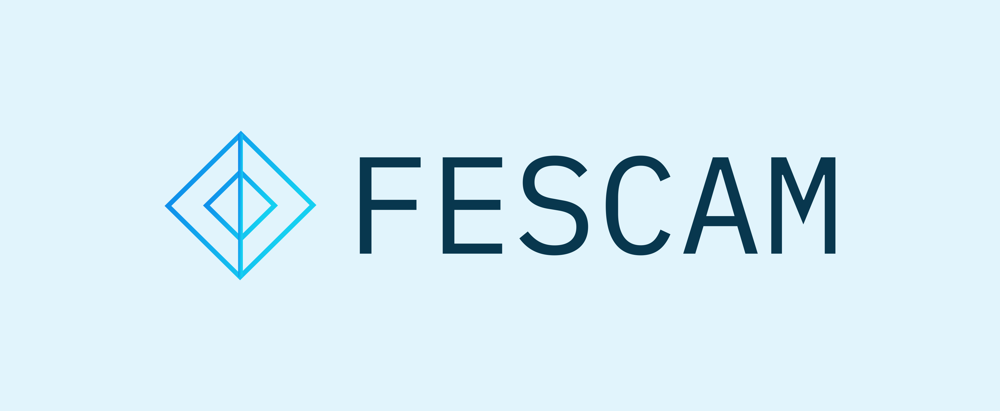

# FE-S.C.A.M.

Front-end prototype design




## Como executar

> Aqui, estamos assumindo que você tem uma instalacão atualizada do Python 3.9 ou superior. Caso contrário, siga as instruções em Python.org 

1. ### Crie o ambiente virtual
```
python3 -m .venv
```

2. ### Ative o ambiente virtual do Python
Dentro da pasta do projeto, execute:

```bash
source .venv/bin/activate  # Em sistemas baseados em Unix (Ex.: Linux, Mac, *BSD)
```
```powershell
.venv\Scripts\activate.bat  # No Windows
```

3. ### Instale as dependências
```bash
python3 -m pip install -r requirements.txt
```

4. ### Execute o servidor
```bash
python3 server.py
```


_Caso de dúvida com o ambiente virtual, consulte a [Documentação Oficial do Python](https://docs.python.org/3/tutorial/venv.html)._